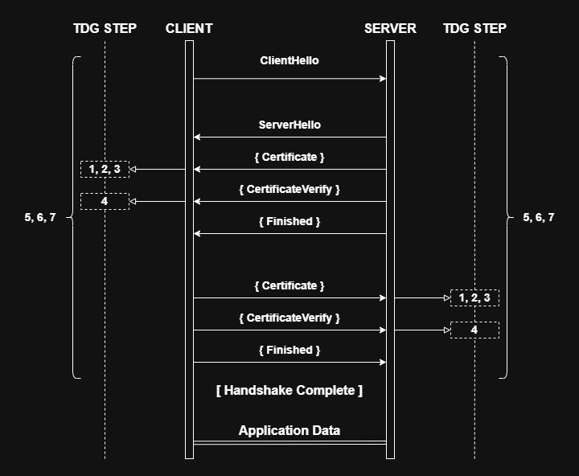

# mTLS Trust Decision Lab

A verifier-centric lab that models mTLS as an ordered sequence of trust
decisions, with reproducible failure cases and evidence-based diagnosis.

## What this is

mTLS failures are not random. Every failure maps to a specific decision
the verifier made on a specific input. This lab makes that explicit.

It implements the Trust Decision Graph (TDG), a seven-step model of how
a verifier evaluates certificate-based trust during a TLS handshake:



Each step in the graph consumes specific inputs, produces a deterministic
outcome, and maps to a named failure archetype when it fails. Every failure
case in this lab is reproducible, classifiable, and fixable from collected
evidence.

## What this lab does not cover

- Production concerns
- Scaling
- Zero Trust architecture
- Automated cert lifecycle
- Revocation (CRL / OCSP)

## Prerequisites

- Docker Desktop with WSL2 integration enabled
- `docker compose` available inside WSL
- `openssl` available inside WSL
- `python3` available inside WSL

**Known issue**: `docker-credential-desktop.exe: exec format error`\
Cause: Docker is trying to use a Windows credential helper inside Linux.\
Fix: remove `credsStore` or `credHelpers` from `~/.docker/config.json` in WSL.

## Quickstart

### 1. Generate certificates

```bash
make certs
```

This generates the full PKI hierarchy: root CA, intermediate CA, server
cert, and client cert. All certs are written to `certs/`.

### 2. Start the stack

```bash
make restart
```

Starts nginx and Flask via Docker Compose.

### 3. Run the baseline success case

```bash
make success-run
```

Runs a valid mTLS handshake. The analyzer classifies the result as
`BaselineSuccess`. Evidence is written to `evidence/success_<timestamp>/`.

## Running failure cases

Each failure case requires both an archetype and a case name.

### Single failure case

```bash
make fail-run ARCHETYPE=<archetype> CASE=<case>
```

Example:

```bash
make fail-run ARCHETYPE=MissingPeerCredentialsFailure CASE=MissingClientCertificateCase
```

Evidence is written to `evidence/<case>_<timestamp>/`.
The analyzer runs automatically and prints the result.

### All failure cases

```bash
make all
```

Runs every implemented failure case in sequence. Each case produces its
own evidence bundle and analyzer output.

### Implemented cases

| Archetype | Case |
|---|---|
| `MissingPeerCredentialsFailure` | `MissingClientCertificateCase` |
| `PrivateKeyProofFailure` | `CertificateVerifySignatureMismatchCase` |
| `IncompleteChainFailure` | `MissingIntermediateCase` |
| `TrustAnchorResolutionFailure` | `WrongTrustAnchorCase` |
| `TrustAnchorResolutionFailure` | `UntrustedSelfSignedLeafCase` |
| `ValidityWindowFailure` | `ExpiredCertificateCase` |
| `ValidityWindowFailure` | `NotYetValidCertificateCase` |
| `UsageConstraintFailure` | `ExtendedKeyUsageConstraintCase` |
| `UsageConstraintFailure` | `BasicConstraintsViolationCase` |
| `SubjectIdentityMismatchFailure` | `DnsSanMismatchCase` |

## Regenerating certificates

To regenerate the full PKI from scratch and restart the stack:

```bash
make regen
make restart
```

To regenerate certs and run all failure cases in one command:

```bash
make all
```

## Evidence structure

Each run writes a self-contained evidence bundle:

```
evidence/<run_id>/
  client/handshake.txt          # curl verbose output
  server/error.log              # nginx error log
  server/nginx_T.txt            # nginx running configuration
  server/flask_container_logs_since_run.txt
  inputs/client/cert.crt        # client cert as presented
  inputs/server/fullchain.crt   # server chain as presented
  inputs/client/key.pubkey_sha256.txt
  inputs/client/cert.pubkey_sha256.txt
  certs/fields/client_cert.txt  # parsed cert fields
  metadata/verifier_cmd.sh      # exact curl command used
  metadata/verifier_inputs.parsed.txt
  result.json                   # analyzer output
  result.txt                    # human-readable summary
```

## Analyzer

The analyzer classifies each run automatically. To run it manually:

```bash
python3 scripts/analyze_run.py <OUT_DIR>
```

Output fields include: `status`, `warning`, `archetype`, `case`,
`decision_step`, `failing_input`, `evidence_file`, `failure_signal`,
`minimal_fix`.

## If you hit an error string

See `docs/common-mtls-errors.md` for a symptom-first index of every
failure case, what the common wrong fix is, and the correct fix.

## Architecture

See `docs/mtls-trust-model.md` for the architectural argument: when mTLS
is appropriate as a control, when it is harmful, and what distinguishes
a verifiable trust decision from the appearance of one.