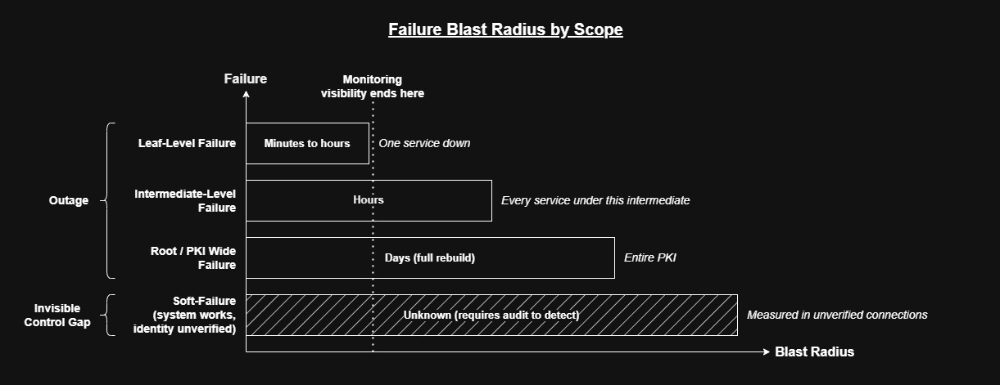

# mTLS Trust Model


### When mTLS is in place, is identity actually being decided, or just assumed?

This is not a question about whether mTLS is enabled.
It is a question about whether the verifier's trust decision sequence
is explicit, reproducible, and provable under adversarial conditions.

---

## Why This Question Matters

Enabling mTLS is a one-line configuration change.

**Trusting that mTLS is enforcing identity is an assumption** that collapses
silently in production under conditions that no configuration review will catch.

The conditions that collapse this assumption are common:
- A wrong trust store passed to the wrong service
- A missing intermediate in the presented chain
- An expired cert on a service nobody owns
- A CA:TRUE client cert accepted by a lenient verifier
- A `--insecure` flag that survived a debugging session into production
- A clock 4 minutes ahead in one region

None of these produce an error at deployment time.
All of them produce a failure or a silent bypass at verification time.

The decision this lab forces is architectural:

**Does your mTLS implementation produce verifiable trust decisions,
or does it produce the appearance of trust decisions?**

These are not the same thing.
The difference is only visible when something fails,
or when an auditor asks for evidence of the opposite.

---

## The Trust Decision Graph

Every mTLS failure maps to a specific step in an ordered sequence of
decisions the verifier executes against explicit inputs. There is no
randomness in this. The sequence is:

```
Step 1 - Peer Certificate Presentation
         Was the expected certificate material presented?

Step 2 - Trust Anchor Resolution
         Does the chain terminate at a trust anchor the verifier accepts?

Step 3 - Path Building
         Can the verifier construct a complete, unbroken chain to the anchor?

Step 4 - Proof of Possession
         Did the peer prove it holds the private key for the presented cert?

Step 5 - Time Validity
         Is verification time within NotBefore/NotAfter for every cert in the chain?

Step 6 - Usage Constraints
         Do the cert's declared constraints permit the intended role and purpose?

Step 7 - Identity Binding
         Does the cert's asserted identity match the identity the verifier expected?
```

These steps are the logical dependencies of certificate-based trust.

A verifier that skips or soft-fails any step does not produce a weaker
trust decision: it produces no trust decision at all for that step.

The full model is documented in `docs/trust-decision-graph.md`.

---

## When mTLS Is Appropriate

mTLS is appropriate when all of the following are true:

**Identity must be bindable.**\
The communicating parties have stable, verifiable identities expressible
as X.509 certificates. The identity must be meaningful to both the issuing
CA and the verifying service (not just a hostname that resolves to the right IP).

**Ownership must exist.**\
Every certificate in the system has an explicit owner responsible for
knowing its expiry date, rotating it before expiry, knowing which services
depend on it, and being paged if it fails.
Certs without owners are time-delayed outages.

**Rotation must be operable.**\
The cert rotation process must be executable without a production incident,
testable in a non-production environment, faster than the blast radius of
an expiry event, and documented as a runbook.
If rotation requires a manual process that takes longer than the service's
acceptable downtime, mTLS is a liability.

**Evidence must exist.**\
The trust decisions made by the verifier must be observable after the fact.
"mTLS is enabled" is not evidence. Evidence is logs that confirm which
identity was verified, artifacts that prove which cert was presented and
accepted, and a deterministic replay of the verification outcome from
collected inputs. Without evidence, mTLS cannot survive an audit or an
incident review.

---

## When mTLS Is Harmful



**Verification is optional where it should be mandatory.**\
`ssl_verify_client optional` is the most common harmful configuration
in mTLS deployments. It produces the operational appearance of mTLS
while providing none of the identity enforcement. Requests that arrive
without a client cert are accepted. Requests that arrive with an invalid
cert are accepted, the access log shows TLS, but no identity was verified.

**Hostname verification is disabled in a client.**\
`curl --insecure`, `InsecureSkipVerify: true`, or any equivalent that
bypasses Step 7 removes the only guarantee that the server is who it
claims to be. The channel is encrypted. The identity is unverified.
Any certificate that passes Steps 1–6 from any trusted issuer can
impersonate the target service.

**Cert lifecycle is not automated and not monitored.**\
A cert expiring in 14 days with no automated rotation and no alert is
not a security control. It is a scheduled outage. At zero days remaining,
the incident is guaranteed.

**Trust stores are environment-specific and undocumented.**\
If the trust store used by a verifier is not tracked as a versioned
artifact, the verifier's trust decisions are not reproducible. The same
connection attempt may succeed in staging and fail in production because
the trust stores diverged without anyone noticing.

**Recovery from a failure is not documented.**\
If no runbook exists for "what do we do when the client cert is rejected
at 3am," mTLS adds blast radius without adding control. The failure mode
is well-defined. The recovery path must be equally defined.

---

## Decision Inputs Required for mTLS to Be Meaningful

For a trust decision to be explainable, reproducible, and defensible,
the following inputs must be explicit and versioned:

| Input | Why It Must Be Explicit |
|---|---|
| Trust store source and version | The verifier's trust decisions are only as stable as the trust store |
| Presented chain contents | Which certs were on the wire, not which certs are on disk |
| Verification policy mode | `require` vs `optional` vs `none` are categorically different security postures |
| Cert validity windows for every cert in the chain | Leaf expiry is monitored; intermediate expiry almost never is |
| Cert field values (EKU, BasicConstraints, SAN) | Constraints never checked can fail silently on the next library upgrade |
| Verifier clock at verification time | Clock skew makes time validity non-deterministic |
| Private key / cert correspondence | A key/cert mismatch is undetectable from logs — it requires explicit hash comparison |

If any of these inputs is implicit, undocumented, or unavailable after
the fact, the trust decision that depended on it cannot be reproduced
or defended.

---

## Hidden Inputs That Flip Outcomes

These are the inputs that don't appear in configuration review, cert
field inspection, or deployment checklist.
However, they determine whether the trust decision succeeds or fails.

**Trust store source ambiguity.**\
The system trust store and the explicitly passed CA bundle are different
objects. A working curl command in a developer shell may fail in CI
because the container has a different system trust store.

**Intermediate presence in the presented chain vs on disk.**\
The intermediate cert exists on disk. Whether it is included in the
presented TLS chain depends on how the server's `ssl_certificate`
directive was assembled. A leaf-only PEM served as `ssl_certificate`
produces a broken chain even though the intermediate file exists.

**`ssl_verify_client optional` as a permanent state.**\
Set during migration or testing and never changed to `require`. The
system passes every cert-related review because the cert files are valid.
The control review misses that the verifier never enforces them.

**Library version enforcement changes.**\
A cert with no `clientAuth` EKU or with `CA:TRUE` BasicConstraints that
works against an older OpenSSL build fails against a newer one or against
a Go or Java verifier.

**Clock skew between verifier and issuer.**\
A cert issued by a CA whose clock is ahead of the verifier's clock is
not yet valid at the moment of issuance. The failure is systematic and
every cert from that CA is not yet valid until the clocks converge.

**Long-lived connections masking expiry.**\
A connection established before cert expiry continues after expiry.
New connections fail. The failure appears load-dependent and intermittent
when it is fully deterministic. It depends on whether the connection
predates the expiry window.

---

## Failure Signals That Invalidate mTLS as a Control

| Signal | What It Means |
|---|---|
| `ssl_verify_client optional` in any mTLS context | Client identity is not enforced; connections without a cert are accepted |
| `--insecure` or `InsecureSkipVerify` anywhere in the request path | Server identity is not verified; the encrypted channel has no confirmed peer |
| Any cert in the chain with no explicit owner | Identity will stop being enforced at that cert's expiry with no warning |
| Trust store updated manually without a versioned artifact | Trust decisions are not reproducible; the verifier's behavior can change without a change event |
| No alert on intermediate cert expiry | Fleet-wide identity failure is unmonitored; the blast radius is unbounded |
| Rotation process documented as tribal knowledge only | mTLS will fail the first time the person who knows how to rotate is unavailable |
| No evidence collected at verification time | The trust decision cannot be reviewed, audited, or replayed |

When these signals are present, mTLS is not a security control.
It is a security assumption dressed as a control.
The cost of that distinction is paid during outages and audits.

---

## What This Lab Proves That Slides Do Not

A slide that says "mTLS enforces mutual identity verification" is correct.
But there is no slide that shows what happens when
it fails, why it fails where it fails, and what evidence proves the failure.

This lab provides what slides cannot:

**Deterministic failure reproduction.**\
Each failure case is reproducible with one command. The failure is the actual verifier rejection produced by the actual
inputs that would cause the same rejection in a production system.

**Step-level failure attribution.**\
Each failure case maps to a specific step in the Trust Decision Graph.
The failing step determines the root cause, the blast radius, and the
minimal fix. Without step-level attribution, every mTLS failure looks
like "cert problem" (which is too broad to fix correctly).

**Evidence that survives the failure.**\
Each failure case produces a collected evidence bundle: logs, cert fields,
hash comparisons, handshake transcripts. The evidence is enough to
classify the failure without a live system.

**Soft-fail detection.**\
Some failures in this lab succeed. The connection completes, Flask
receives the request, and the verifier accepted a structurally invalid
credential because its enforcement policy was lenient. These are the
most dangerous outcomes: the system behaves correctly, the logs are
clean, and the identity assurance is absent. A system that cannot
detect its own soft-fails cannot be audited.

**Reproducibility as a system property.**\
Any failure in this lab can be reproduced by anyone with the repo,
the Makefile, and Docker Compose.
Reproducibility is not a testing convenience; it is the definition of a deterministic
trust system. If the failure cannot be reproduced, the fix cannot
be verified.

---

## What This Lab Does Not Prove

**Production readiness.**
The lab uses a minimal stack: nginx, Flask, OpenSSL, step-ca.
Production systems add load balancers, service meshes, HSMs,
multi-region trust store distribution, and automated rotation pipelines.
Each addition introduces hidden inputs not modeled here.

**Revocation.**
CRL and OCSP are not implemented. A revoked cert passes all seven steps
in this lab if the verifier is not configured for revocation checking.
Revocation is a separate decision layer above the TDG and is out of
scope for this lab.

**Multi-verifier behavior.**
All failures are reproduced against a single nginx/OpenSSL verifier.
The same cert may produce different outcomes against a Java verifier,
a Go verifier, or a browser. Verifier-specific hidden inputs (CN
fallback, EKU enforcement, BasicConstraints strictness) are documented
in the TDG but not reproduced across multiple verifiers here.

**Application-level identity binding.**
Step 7 in the `server_verifies_client` direction is not enforced by
nginx by default. A client cert that passes Steps 1–6 is accepted
regardless of SAN content. Whether the application then verifies that
the client's identity corresponds to an authorized service is an
application decision, not a TLS verifier decision. That boundary is
documented in the TDG but not implemented here.

**Automated lifecycle.**
Cert rotation, renewal, and revocation automation are out of scope for
this lab. This lab intentionally isolates the verification decision from
the lifecycle decision so each can be understood and tested independently.

---

## The Question This Lab Answers

> "When something fails in our mTLS deployment, can we tell which
> decision failed, on which input, for which service, and what the
> minimal correct fix is?"

If the answer is no, the system is not deterministic.
If the system is not deterministic, it cannot be audited.
If it cannot be audited, it cannot be called a control.

This lab exists to make the answer yes,
and to produce the evidence that proves it.