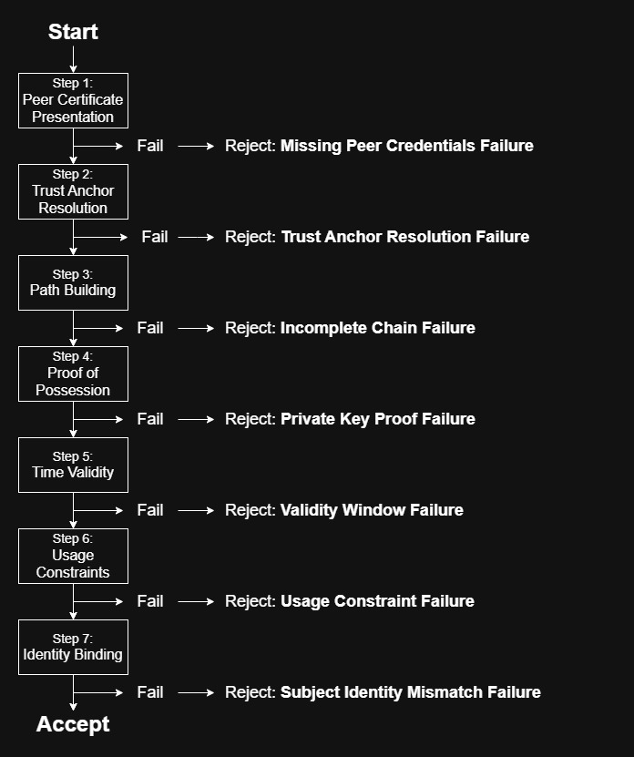

# Trust Decision Graph

The Trust Decision Graph (TDG) is a formal model of how a verifier
evaluates certificate-based trust during a TLS handshake.

Every mTLS success or failure is the result of a verifier executing this
sequence against specific inputs. Every failure
maps to a specific step failing on a specific input.



---

## Inputs

The verifier consumes inputs from three layers:


**Peer-Supplied Layer**:
What the peer sends over the wire during the handshake:
- Presented Certificate Chain (leaf + intermediates)
- CertificateVerify Message (signature proving key possession)
- Stapled OCSP Response (optional)

**Verifier Configuration Layer**:
How the verifier was configured before the handshake began:
- Trust store / trust anchors
- Verification policy configuration (client cert required, verify depth, etc.)
- Revocation configuration

**Environment Layer**:
Inputs that exist outside both parties but determine the outcome:
- Current time (at the verifier's clock)
- Target identity (hostname, IP, or URI the client expected)
- External revocation data (if fetched)

The inputs in the right column of the diagram are hidden inputs: they are
not in the cert fields, not in the configuration review, and not in the
deployment checklist; but they determine whether the trust decision
succeeds or fails. \
Clock skew, trust store source ambiguity, and
verification policy mode are the most common hidden inputs that produce
unexpected failures in production.

---

## The Decision Sequence

The verifier executes these steps in order. The first step that fails
terminates the sequence. Every subsequent step is irrelevant until the
first failure is resolved.

```
Step 1 - Peer Certificate Presentation
         Was the expected certificate material presented when required?

Step 2 - Trust Anchor Resolution
         Does the chain terminate at a trust anchor the verifier accepts?

Step 3 - Path Building
         Can the verifier construct a complete, unbroken chain to the anchor?

Step 4 - Proof of Possession
         Did the peer prove it holds the private key for the presented cert?

Step 5 - Time Validity
         Is verification time within NotBefore/NotAfter for every cert in the chain?

Step 6 - Usage Constraints
         Do the cert's declared constraints permit the intended role and purpose?

Step 7 - Identity Binding
         Does the cert's asserted identity match the identity the verifier expected?
```

These steps are the logical
dependencies of certificate-based trust.\
A verifier that skips or
soft-fails any step doesn't produce any trust decision at all for that step.

---

## Outputs

Every verification attempt produces exactly one result.


**Clean Accept** (`status=ACCEPT`, `warning=false`):\
All seven steps passed. The connection succeeded with full identity assurance.

**Hard Reject** (`status=REJECT`, `warning=false`):\
A step failed and the verifier terminated the handshake.

**Soft-Fail Accept** (`status=ACCEPT`, `warning=true`):\
A failure condition was detected but the verifier accepted the connection
anyway. This is the most dangerous outcome: the system behaves correctly,
the logs are clean, but the identity assurance is absent.

The fourth state (`status=REJECT`, `warning=true`) is structurally
impossible: if the verifier rejected the connection, there is no
soft-fail to warn about.

---

## Soft-fails

A soft-fail occurs when a step fails but the connection is accepted due
to a lenient verifier policy. Common soft-fail conditions:

- `ssl_verify_client optional`: client identity is not enforced regardless
  of which steps fail on the client chain
- `--insecure` / `InsecureSkipVerify`: server identity is not verified,
  bypassing Steps 2 through 7
- BasicConstraints not enforced: a CA:TRUE client cert is accepted as a
  valid end-entity credential by a lenient verifier

Soft-fails are invisible in standard monitoring and survive all health
checks. They are detected only by inspecting the verification condition
against the connection outcome, not from log signals alone.

---

## Relationship to this lab

This lab implements the TDG as a reproducible diagnostic system.

Each failure case in the lab corresponds to a specific step failing on a
specific input. The analyzer classifies each run automatically, identifies
the failing step, names the archetype, and produces the minimal correct fix.

The full model (including hidden inputs, blast radius analysis, failure
archetypes, and evidence gaps) is available to clients and collaborators.

For the architectural argument behind the lab, see `docs/mtls-trust-model.md`.
For the symptom-first error index, see `docs/common-mtls-errors.md`.
