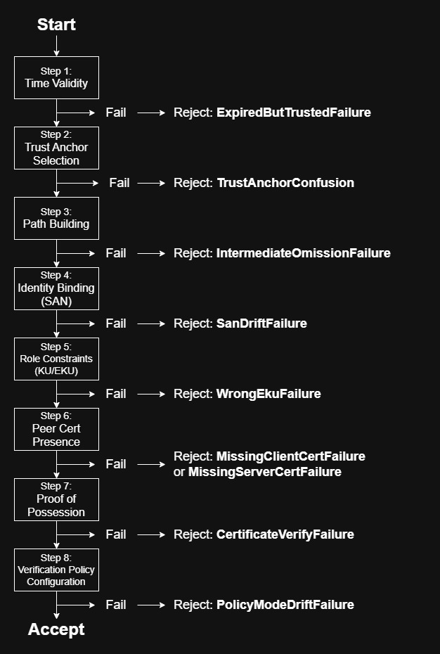

# Trust Decision Graph

The Trust Decision Graph is a formal model of how a verifier evaluates trust in ordered steps.\
It consumes defined inputs and produces either an accept or reject decision, terminating at the first failing condition.
---
**Verifier:** \
The verifier is the component that evaluates certificate trust and produces an accept or reject decision.  
In this lab:
- Nginx acts as the verifier for client authentication (server-side decision).
- curl (using the local CA bundle) acts as the verifier for server certificate validation (client-side decision).
---
**Scope:**  
This trust decision graph models the ordered trust decision executed by a verifier during TLS/mTLS handshake.  
It describes how a verifier evaluates inputs (certificates, trust store, hostname, time, policy configuration) and reaches an accept or reject decision.  
It does not model application logic, authorization, business rules, or network routing.
---

## Graph

---

### Step 1: Time validity

**Inputs:** current time, NotBefore/NotAfter\
**Decision:** is the certificate valid at the current time\
**Failure signal:** “certificate has expired / not yet valid”\
**Archetype:** ExpiredButTrustedFailure\
**Evidence:** openssl x509 -noout -dates, nginx error line\
**Minimal fix:** rotate leaf cert (not root)

### Step 2: Trust anchor selection

**Inputs:** verifier trust store (nginx ssl_client_certificate or client CA bundle)\
**Decision:** which issuer certificates are allowed as trust anchors\
**Failure signal:** “unknown ca” / “unable to get issuer certificate”\
**Archetype:** TrustAnchorConfusion\
**Evidence:** openssl verify -CAfile, nginx error\
**Minimal fix:** correct trust store, not leaf certificate

### Step 3: Path building

**Inputs:** presented chain (leaf + intermediates), verify depth\
**Decision:** can the verifier build a valid chain from the leaf to one of the allowed trust anchors\
**Failure signal:** “unable to get local issuer certificate”\
**Archetype:** IntermediateOmissionFailure\
**Evidence:** openssl verify -untrusted, curl -v chain output\
**Minimal fix:** present required intermediate or correct chain configuration

### Step 4: Identity binding (SAN)

**Inputs:** requested hostname (SNI) and certificate SAN entries\
**Decision:** does the SAN match the requested identity\
**Failure signal:** “no alternative certificate subject name matches”\
**Archetype:** SanDriftFailure\
**Evidence:** curl verification output, openssl x509 -text | grep -A SAN\
**Minimal fix:** regenerate leaf with correct SAN, not CA

### Step 5: Role constraints (KU/EKU)

**Inputs:** EKU/KU on leaf\
**Decision:** does the certificate permit this role (sslserver or sslclient)\
**Failure signal:** “unsuitable certificate purpose”\
**Archetype:** WrongEkuFailure\
**Evidence:** openssl verify -purpose sslclient|sslserver\
**Minimal fix:** correct EKU/KU in leaf profile

### Step 6: Peer cert presence

**Step 6A: Server cert presence**\
**Inputs:** server sends certificate or not\
**Decision:** was a server certificate presented during handshake\
**Failure signal:** handshake fails early, openssl s_client output "no peer certificate available"\
**Archetype:** MissingServerCertFailure\
**Evidence:** openssl s_client, curl verbose transcript\
**Minimal fix:** fix server TLS config to present a certificate

**Step 6B: Client cert presence**\
**Inputs:** client sends certificate or not, nginx ssl_verify_client\
**Decision:** was a client certificate presented when required\
**Failure signal:** “no required SSL certificate was sent”\
**Archetype:** MissingClientCertFailure\
**Evidence:** nginx error, curl without --cert\
**Minimal fix:** present client cert (don’t weaken nginx)

### Step 7: Proof of possession

**Inputs:** CertificateVerify + private key\
**Decision:** can the peer prove possession of the private key corresponding to the presented certificate\
**Failure signal:** handshake alert / bad signature\
**Archetype:** CertificateVerifyFailure\
**Evidence:** curl verbose handshake + nginx error\
**Minimal fix:** correct keypair, not trust store

### Step 8: Verification policy configuration

**Inputs:** ssl_verify_client mode, verify depth, CA bundle contents\
**Decision:** does the current verification policy permit this chain and identity under configured strictness rules\
**Failure signal:** identical certificates produce different outcomes after policy configuration change\
**Archetype:** PolicyModeDriftFailure\
**Evidence:** nginx -T config dump + nginx error logs\
**Minimal fix:** correct verification policy deliberately, not weaken blindly
